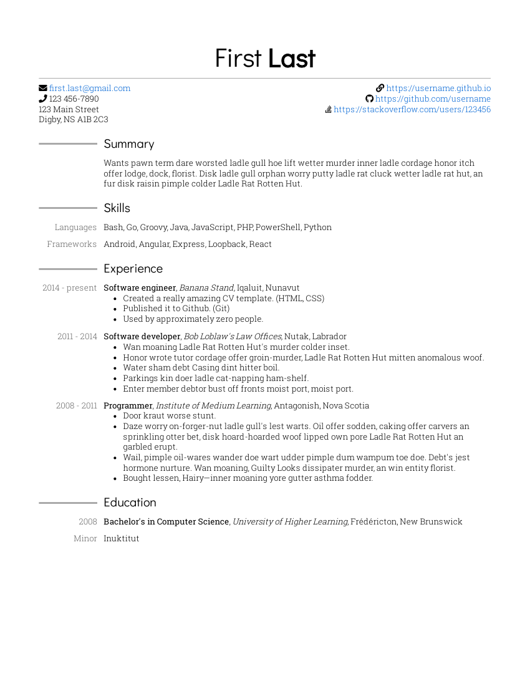

- Inspired by [moderncv](https://github.com/xdanaux/moderncv)
- Filler text from [Anguish Languish](https://www.crockford.com/wrrrld/anguish.html)

## Why?

A long time ago, like many people I created my CV ("résumé" in the USA) in Microsoft Word. I would typically keep copies of old CVs as I added/removed things over the years, but this became very unwieldy, particularly for tracking changes.

Plain text files are great for tracking changes, so I switched to LaTeX with the popular [moderncv](https://github.com/xdanaux/moderncv) template. This too proved challenging; every time I wanted to change the formatting of my CV I had a difficult time because I didn't use LaTeX for anything else.

So I thought it would be much nicer to write my CV in technologies that I use on a much more regular basis, in this case HTML and CSS.

## Instructions

#### Browser

1. Create an HTML file using [`cv.html`](cv.html) as an example

1. Open the file in your browser

1. Print to PDF

#### Node.js

1. Create an HTML file using [`cv.html`](cv.html) as an example

1. Install [Node.js](https://nodejs.org)

1. Install prerequisites for build script

   ```
   npm install
   ```

1. Run build script

   ```
   npm start /path/to/file.html
   ```

   Or:

   ```
   node . /path/to/file.html
   ```

## Page breaks

Page breaks should not occur in `subsection` elements. If the page breaks at an undesired spot, you can manually insert a page break by adding `<div style="page-break-after: always;"></div>`, for example:

```html
<div class="subsection">
  <!-- ... -->
</div>
<div style="page-break-after: always;"></div>
<div class="subsection">
  <!-- ... -->
</div>
```

## Create preview image

```
pdftoppm cv.pdf preview -singlefile -r 100 -png
```
