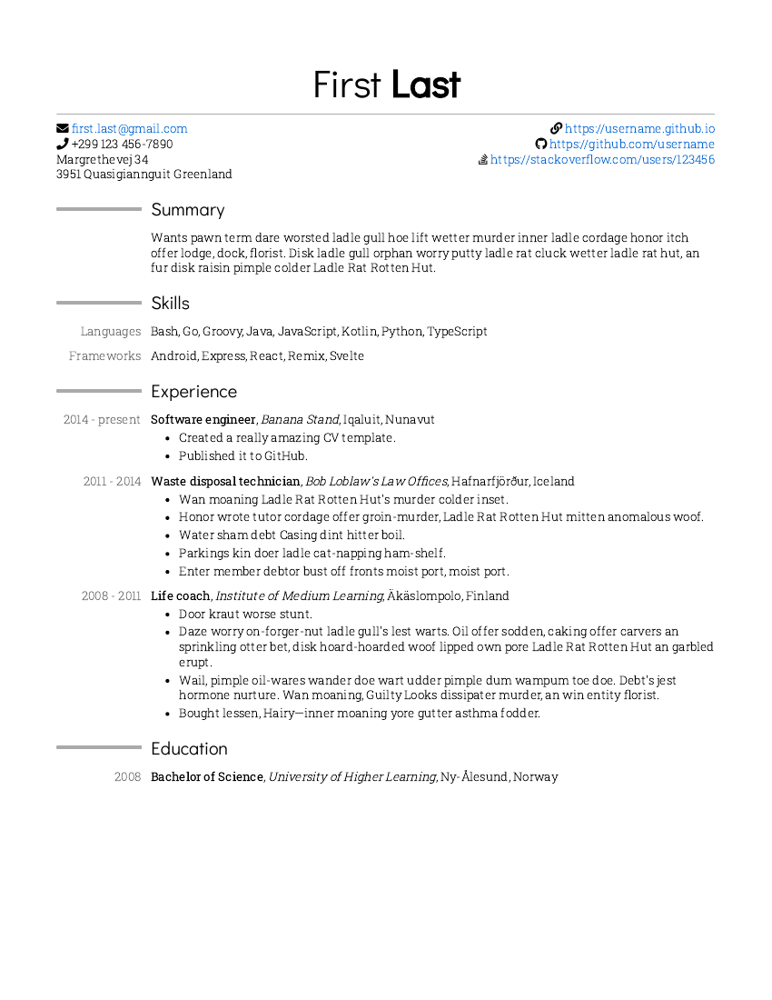

- Inspired by [moderncv](https://github.com/xdanaux/moderncv)
- Filler text from [Anguish Languish](https://www.crockford.com/wrrrld/anguish.html)


### Instructions

1. Install [Node.js](https://nodejs.org)

2. Install prerequisites for build script

    ```
    npm install
    ```

3. Modify cv.html as desired

4. Run build script

    ```
    npm start
    ```

    Or:
    ```
    node .
    ```


### Page breaks

If the page breaks at an undesired spot, you can manually insert a page break by adding `<div style="page-break-after: always;"></div>` in between sections, for example:

```html
<div class="section">
  <!-- ... -->
</div>
<div style="page-break-after: always;"></div>
<div class="section">
  <!-- ... -->
```


### Create preview image

```
pdftoppm cv.pdf preview -singlefile -r 100 -png
```
